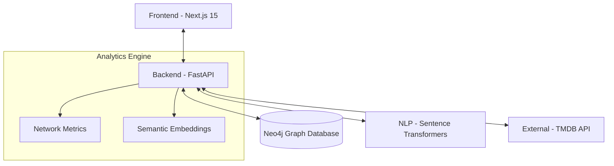

# Aether — Semantic Media Knowledge Graph 🌌

[](https://nextjs.org/)
[](https://fastapi.tiangolo.com/)
[](https://neo4j.com/)
[](https://www.python.org/)
[](https://www.typescriptlang.org/)

> **Aether** is a high-performance intelligence platform that transforms flat cinematic data into a multi-dimensional **Knowledge Graph**. By combining Graph Science with modern NLP, Aether uncovers hidden relationships between movies, creators, and themes that traditional databases miss.

---

## 🚀 Features

- **🕸️ Interactive Knowledge Graph**: Visualize the cinematic universe in real-time with a D3-powered force-directed graph. Explore nodes, isolate clusters, and discover non-obvious connections.
- **🧠 Semantic Intelligence**: Leverages `sentence-transformers` to generate vector embeddings for movie plots, enabling theme-based "Semantic Recommendations" that go beyond keyword matching.
- **📊 Deep Analytics Dashboard**: Real-time calculation of network metrics including **Graph Density**, **Average Degree**, and **Centrality Metrics** to identify the most influential entities in the database.
- **⚡ Automated Ingestion**: Seamless bridge with the TMDB API to dynamically ingest and structure raw media data into the specialized Neo4j schema.
- **🌓 Premium Monochrome UI**: A state-of-the-art aesthetic using the **Geist Typography** system, featuring high-contrast Light/Dark modes optimized for data legibility.

---

## 🛠️ Architecture

Aether uses a decoupled, high-throughput architecture designed for semantic interoperability.



---

## 📦 Tech Stack

- **Frontend**: Next.js 15, Tailwind CSS, Geist Sans/Mono, Recharts, React-Force-Graph.
- **Backend**: FastAPI, Uvicorn, Pydantic v2.
- **Data Layer**: Neo4j (Cypher Query Language).
- **AI/NLP**: PyTorch, Sentence-Transformers (all-MiniLM-L6-v2).

---

## 🏁 Getting Started

### Prerequisites

- [Node.js 18+](https://nodejs.org/)
- [Python 3.10+](https://www.python.org/)
- [Neo4j Instance](https://neo4j.com/download/) (Local or AuraDB)

### 1. Setup Backend
```bash
cd backend
python -m venv venv
source venv/bin/activate  # venv\Scripts\activate on Windows
pip install -r requirements.txt
# Configure .env with NEO4J_URI, NEO4J_USER, NEO4J_PASSWORD, TMDB_API_KEY
uvicorn app.main:app --reload
```

### 2. Setup Frontend
```bash
cd frontend
npm install
# Configure .env.local with NEXT_PUBLIC_API_URL
npm run dev
```

---

## 🤝 Contributing

Contributions are welcome! Whether it's adding a new graph algorithm, improving the NLP model, or refining the UI aesthetics, feel free to open a PR.

1. Fork the Project
2. Create your Feature Branch (`git checkout -b feature/AmazingFeature`)
3. Commit your Changes (`git commit -m 'Add some AmazingFeature'`)
4. Push to the Branch (`git push origin feature/AmazingFeature`)
5. Open a Pull Request

---

## 📜 License

Distributed under the MIT License. See `LICENSE` for more information.

---

Developed with ❤️ by [atish4y](https://github.com/atish4y)
